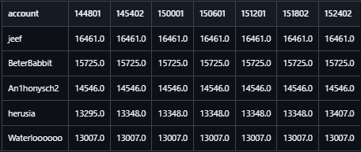
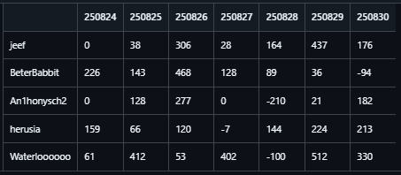

# Hearthstone Battlegrounds Leaderboard Database — Season 11 (08/2025)

This repository contains the results of my data-fetching project focused on Hearthstone Battlegrounds leaderboards. The motivation behind this project is to collect high-frequency time series data.

---

## What is Hearthstone?

Hearthstone is an online card game by Blizzard Entertainment featuring several game modes with independent ranking systems.
This database focuses on the Battlegrounds and Battlegrounds Duo modes, both of which use an MMR (Matchmaking Rating) system to determine leaderboard positions across three regions.
The leaderboard includes all players with at least 8000 MMR.

---

## Data source

Player rating data is published in on Blizzard’s official website and is also available through their API.  
Players and their rankings are distributed across **two game modes** (Battlegrounds, Battlegrounds Duo) and **three regions** (EU, US, AP).  

This project fetches leaderboard data **every 6 minutes** for each game mode/region combination, and stores it in daily database files.

Each database file contains:
- One table per day.
- Player data structured in rows, where each column represents a specific fetch instance (i.e., every 6 minutes).

---

## Previews

Below are some previews showcasing the dataset structure.  
All examples are for the **"US" region** and **"bgs" game mode** leaderboards, showing the top 5 players during the first 7 days.  

### Raw csv
Taken from the first day 250824.  
  
[Preview file](./previews/USbgs_inputdataexample.csv)  

### Daily record
  
[Preview file](./previews/USbgs_recordpreview.csv)  

### Daily total
  
[Preview file](./previews/USbgs_sumpreview.csv)  

---

## Considerations
- The first few days of the season are missing due to setup issues. 
- Battlegrounds Season 11 corresponds to Season 16 internally in the official API, hence the naming of the files.

---
